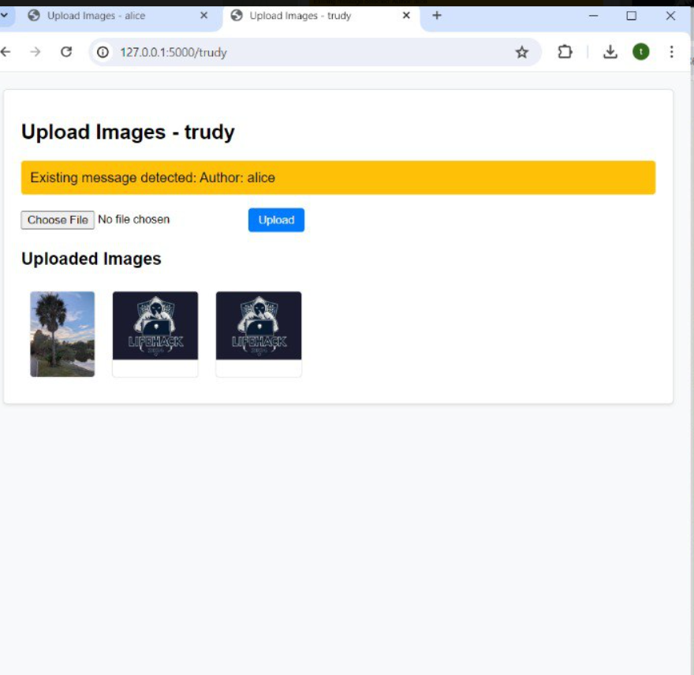
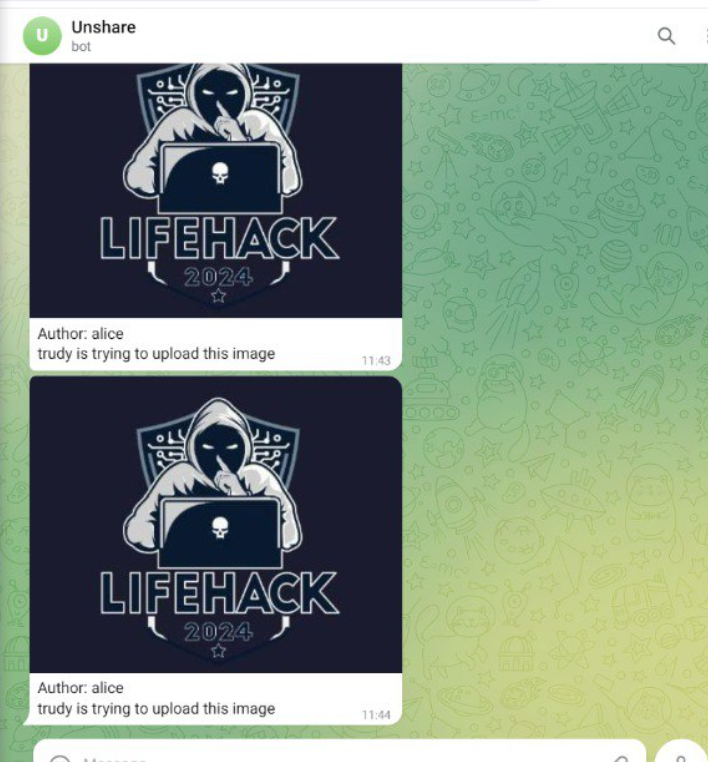

# NUSLifeHack2024 - Team Keropok - UNShare

## Table of Contents
- [Introduction](#introduction)
- [Features](#features)
- [Installation](#installation-and-set-up)
- [Sample Screenshot of the App](#sample-screenshot-of-the-app)
- [Demo](#demo)

## Introduction
With social media, content is easily shared but also easily stolen. UNShare combats copyright infringement by embedding hidden data in images to identify and prevent unauthorised uploads. Admin will be notified by such infringmement via a telegram bot.

This projects contains a prototype of our idea.

## Features
- Images are checked for metadata contained in the images.
- If no metadata of the defined type is in the image, then new metadata will be written on the image
- Else, the data will be flaged out to the admin via telegram bot especially if the uploader is different from the original poster.

## Installation and Set Up
1. Clone the repository
```
git clone https://github.com/yicheng-toh/NUSLifeHack2024.git
```
2. Install required files to run the program. (You may want to create a virtual env before doing so)
```
pip install -r requirements.txt
```
3. Create .env file that is not on github.
These are the contents in .env file. Please replace the details as defiend by the angle brackets.
```
TELE_API_KEY = <telegram bot api key>
ID1= [<telegram chatid1>,<telegram chatid2>]
```
4. After which, run the following command to start the Flask Program.
```
python mainroute.py
```

## Sample Screenshot of the App

Example routes:
Alice: ```http://127.0.0.1:5000/Alice```
Trudy: ```http://127.0.0.1:5000/Trudy```

#### Uploading of Original Images

#### Uploading of Copyrighted Images from the same platform

#### Example of telegram Images



## Demo
For the demo of the software, please proceed to this [video link](https://youtu.be/CUzaZSwAA_I).
